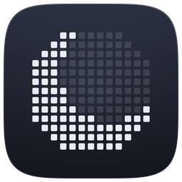

# Luna

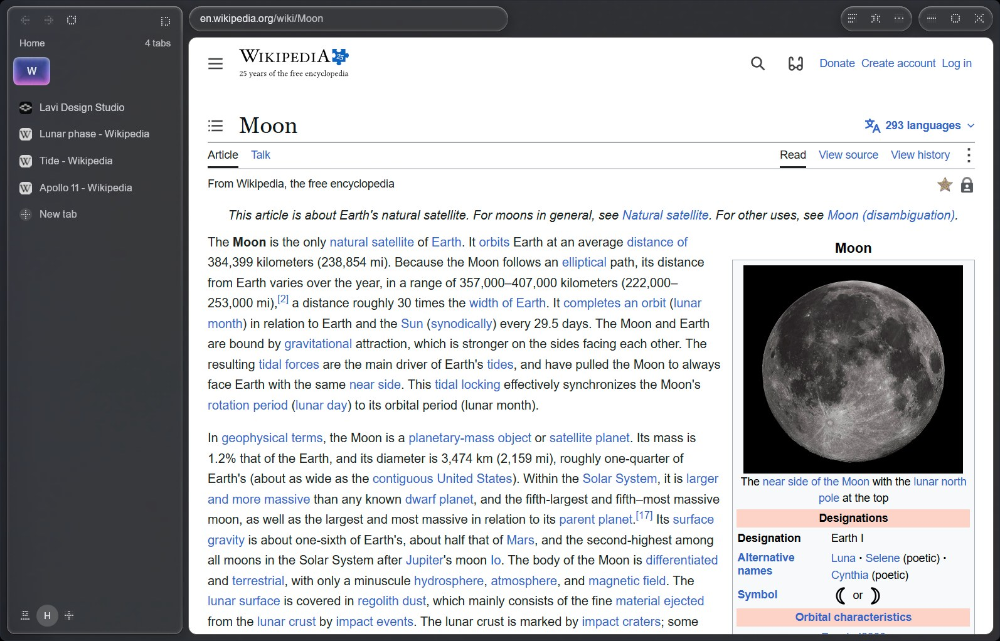

**A small, quiet browser for Windows.** Tabs down the side or across the top, one field that says what it will do,
and the page. Luna draws its own window and hands the pages to **WebView2**, the Chromium that Windows already has,
so there is no second browser to download, update or keep in memory. It is about 6 MB installed, opens its window in
under half a second, and its own window uses no CPU while you are not using it.

[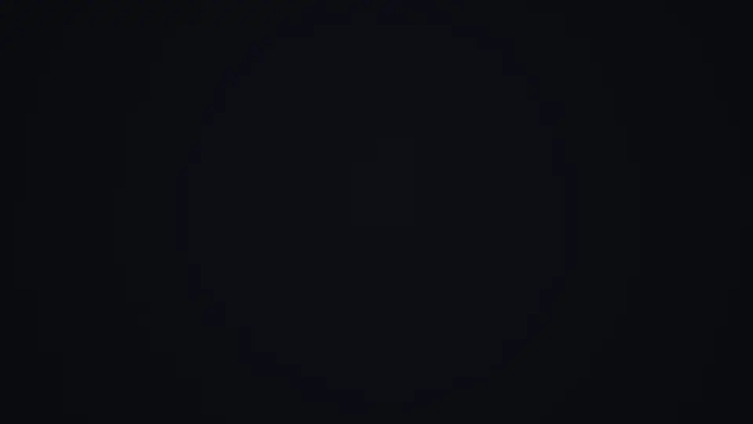](https://github.com/lavi-design-studio/luna-releases/releases/download/v0.13.5/luna-film-40s.mp4)

**Watch the film:** [Luna in 40 seconds](https://github.com/lavi-design-studio/luna-releases/releases/download/v0.13.5/luna-film-40s.mp4) (motion graphic, 1080p60, 58 MB) · [Luna in 30 seconds](https://github.com/lavi-design-studio/luna-releases/releases/download/v0.13.5/luna-film-30s.mp4) (product film, 15 MB). Everything inside a Luna window in both films is real footage of Luna; the dots, type and transitions are motion graphics, and the music was made for them.

This repository holds **signed releases only**: the latest build is on the
[Releases page](https://github.com/lavi-design-studio/luna-releases/releases/latest).

> Screenshots on this page show Wikipedia (text and images under free licences), the
> [author's own site](https://lavidesign.studio), and Luna's own screens. Numbers were measured on one PC
> (Windows 11, Ryzen 7 9700X); see [Known limits](#known-limits) for what they do and do not say.

## Why Luna

### 1. The engine is already in Windows, so Luna is small and light

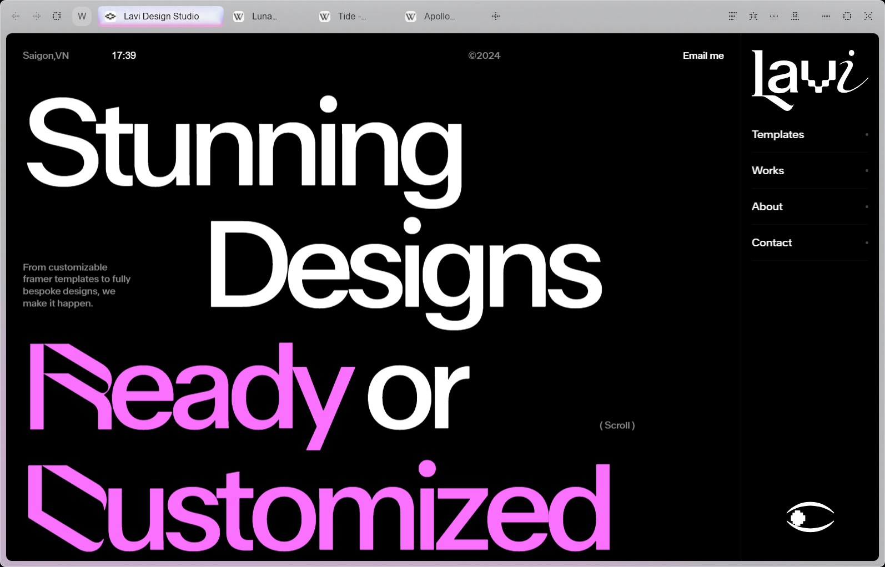

Pages run on Chromium through WebView2, the same engine as Edge. Luna itself is a handful of files:
**about 5.7 MiB installed** (the whole folder with its updater is 16 MiB), **first window in about 0.45 s**
(median 455 ms on a fresh profile, 464 ms on an existing one, 8 runs each), and **one process using about 45 MB**
before the first page is opened. Chromium starts only when a page does.

With five pages open Luna counts 11 processes. For context, headless Chrome and Edge on the same five pages
counted 13 and 12; that comparison is **not like for like** (headless browsers have no window), so read it as "the
same order", not as a win.

*Pearl (light) with tabs across the top is shown above: the frame follows the colour of the page behind it.*

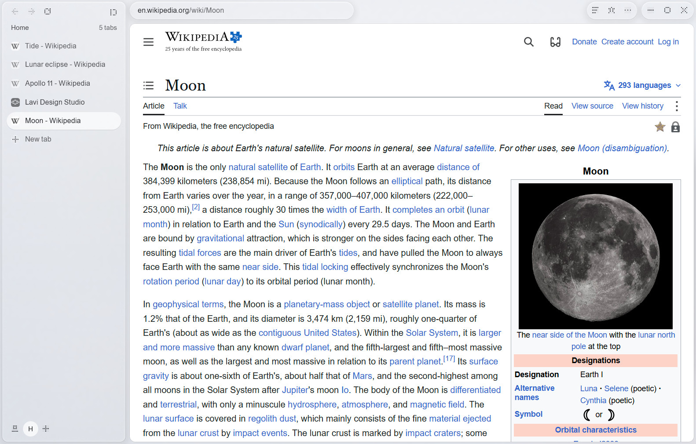

*Liquid Glass by day: the tabs and tools are panes of glass over the page's own light.*

### 2. At rest it costs nothing

Settled, with a still page or an empty tab in front, Luna's own window uses **0% CPU**. Nothing loops: no spinners, no
breathing, no timers running behind panels. Everything that moves does so once, for a fraction of a second, and
stops. Pages Luna cannot see (minimised, on another desktop, or covered for 15 s) stop drawing.

### 3. One field that says what it will do

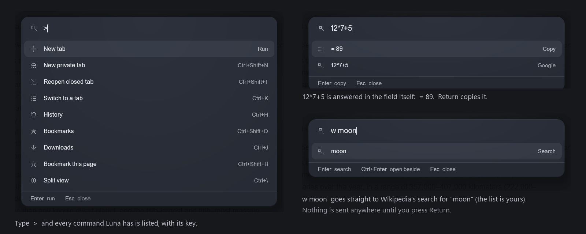

`Ctrl+L` raises one field. It finishes addresses from your history, switches to a tab that is already open, searches
otherwise, and works out sums (`12*7+5` answers `= 89`). `yt moon landing` or `w moon` search YouTube or Wikipedia
straight away (the list is yours, in Settings). Type `>` for every command Luna has, by name, with its key. The row
Return will take is lit and says what it will do. **Nothing you type is sent anywhere before you press Return.**

### 4. Tabs that cost nothing until you look at them

Last session's tabs come back asleep and wake when you click one, showing their last look at once. A tab left alone
for five minutes is suspended, and after half an hour put to sleep (unless it is drawing with the GPU). Pins stay in a
row; tabs you have not opened for a week tidy themselves away, with Undo, and everything remains in history.

### 5. A sidebar that is there when you reach for it

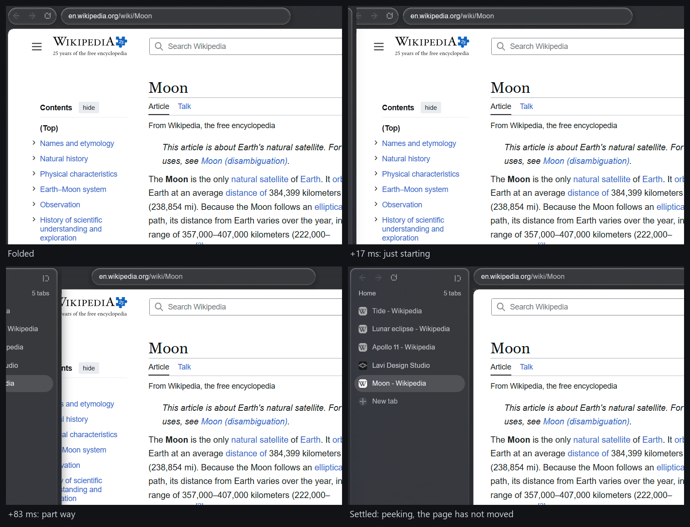

`Ctrl+S` folds the sidebar away and the left edge brings it back, sliding over the page without moving it. The first
moving frame arrives **20-37 ms after the command** for peek and unfold at 125% scaling (40-56 ms for fold), on
a critically damped spring that settles without a bounce. The frames above are real captures of one peek (cropped to the left of the window); the timings come from the
build reports, not from this image.

### 6. Light that follows the page, and plates you can have quiet or luminous

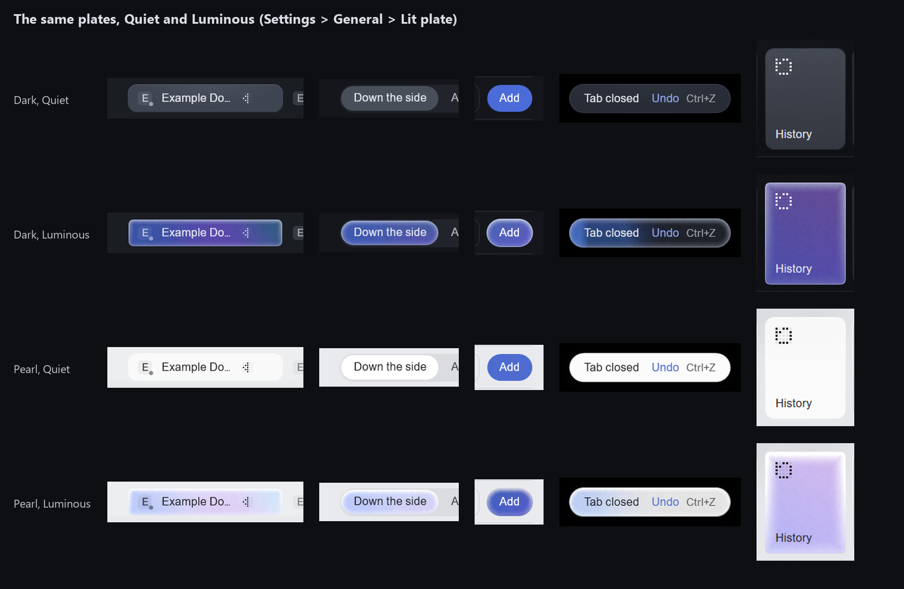

Luna comes in two styles, **Luna** (pearl by day, a deep blue-black by night) and **Liquid Glass**, with a light that
follows the page behind the frame. The tab you are on, the choice you made and the one action that matters are lit;
everything else recedes. In **Settings > General > Lit plate** you choose **Quiet** (a flat fill of light) or
**Luminous** (a soft mesh of moonlit colour, which pours in from the edge when the pointer arrives). Words keep their
contrast either way.

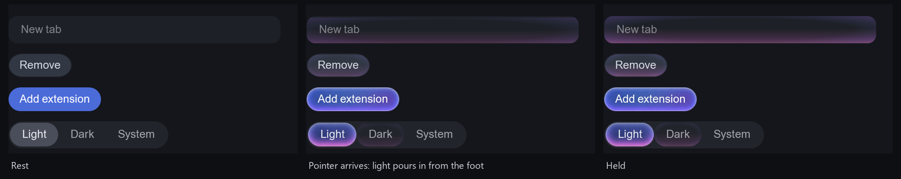

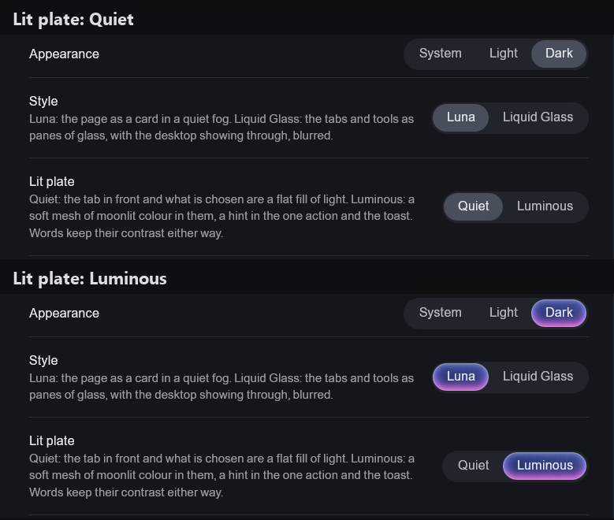

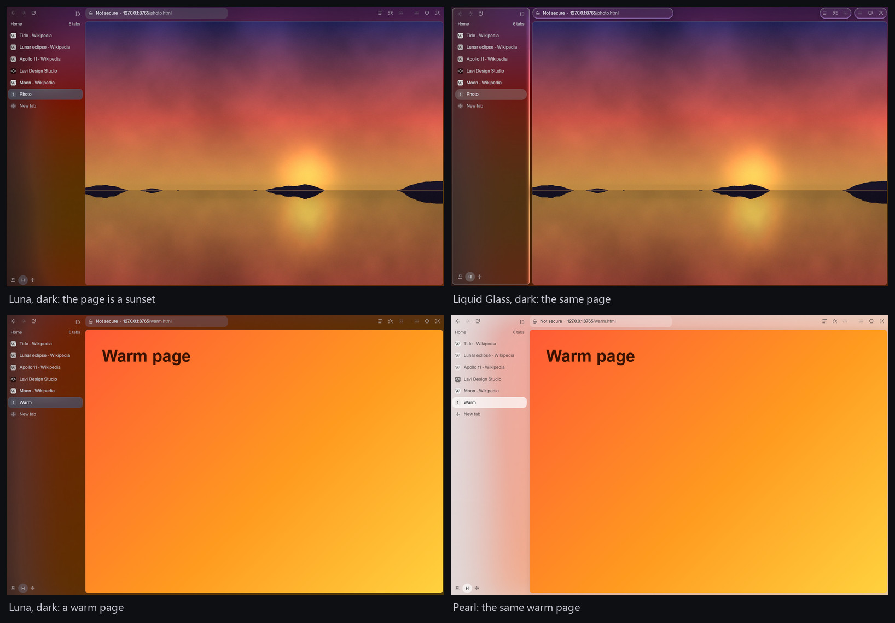

The frame takes its light from the page in front of it: a sunset warms the sidebar and the strip above the page, and an orange page does the same in dark and in pearl. Greys stay grey, and with High Contrast on the page's light is not drawn.

### 7. Design tools in the browser

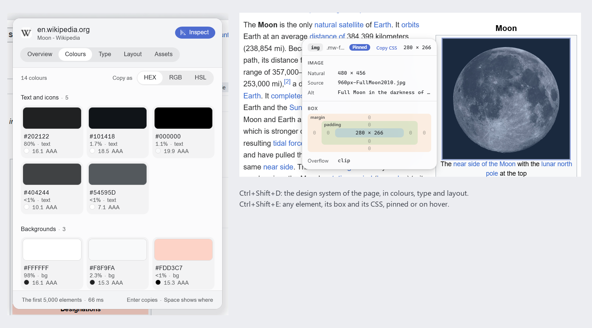

- **Grid** (`Ctrl+Shift+G`) draws the page's own CSS grid over it.
- **Design system** (`Ctrl+Shift+D`) lists the page's colours (with contrast ratios), type and layout; values copy as HEX, RGB or HSL.
- **Inspect** (`Ctrl+Shift+E`) shows any element's box, size, source and CSS on hover, or pinned.

### 8. Snapshot a page to Figma, with pictures, auto layout and grids

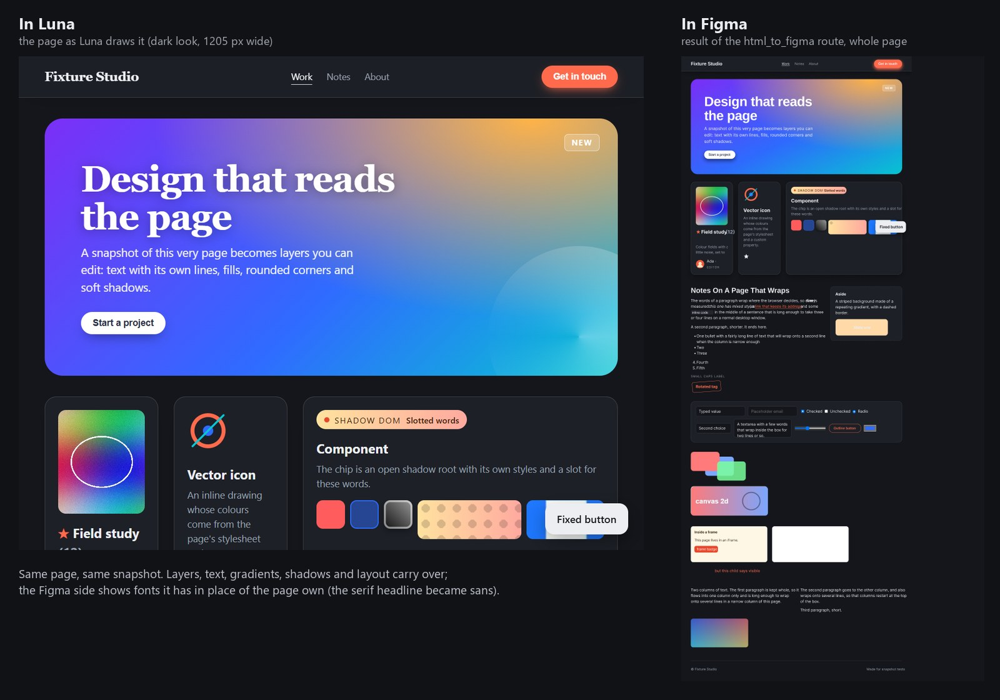

`Ctrl+Shift+F` saves the page (boxes, text lines, fonts, colours, gradients, shadows, pictures, flex and grid layout)
and copies it. In Figma it becomes named frames, auto layout where the page's layout is reproduced exactly,
gradients, shadows and live text. See [Figma](#figma) for the three ways in. The picture above is the author's test
page: Figma's side comes from the HTML-to-design route, and Figma replaces fonts it does not have.

### 9. Bring your bookmarks and history, never your passwords

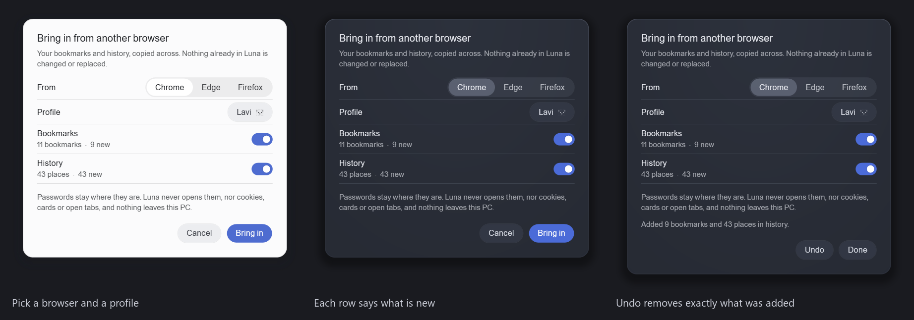

Settings > This PC (or `> import` in the field) brings in bookmarks and history from **Chrome, Edge, Brave, Vivaldi and
Firefox**. You choose browser and profile; each row says what was found and how much is new; running it again adds
nothing; Undo removes exactly what was added. **Passwords, cookies, cards and open tabs are never read**, and nothing
leaves the PC.

### 10. Split view and reading mode

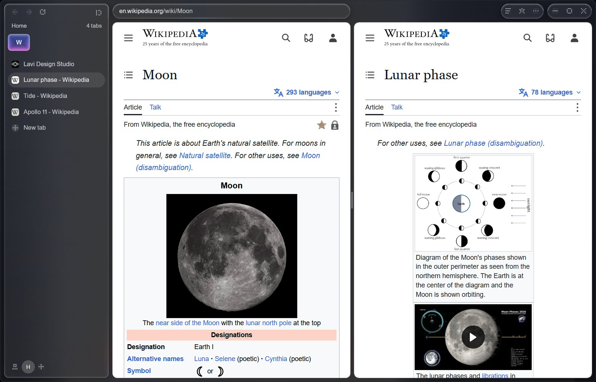

`Ctrl+\` puts the tab you are on beside the one you were on before; `Ctrl+Return` in the field opens a page beside
this one; Shift+click a link to peek it beside the page. Click into either half to work in it.

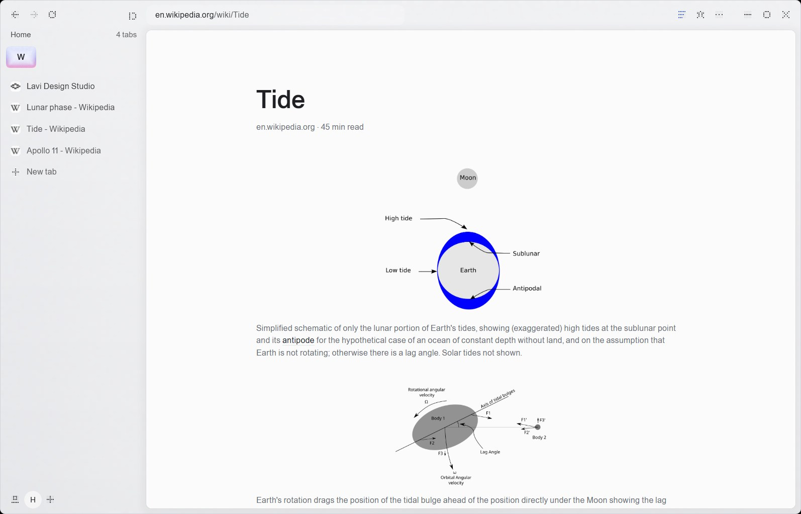

`Ctrl+Shift+R` lays the article, its pictures and nothing else over the page, with a read time and a hairline for how
far you are. Leaving it gives the page back as it was.

### 11. Signed updates, with a way back

An installed Luna asks this repository every few hours for a newer build, downloads only what changed (a delta of a
few hundred KB), **checks that it is signed with Luna's release key** (ECDSA P-256) and installs it when you restart
or the next time Luna closes. If the new build cannot open a window, the previous one is put back. Nothing restarts
on its own, and Settings turns updates off. Every file in a release has a `.sig`.

### 12. Calm when things go wrong, and reachable without a mouse

Since 0.14 and 0.15 the quiet parts got the same care as the busy ones:

- **Luna's own error pages and permission prompt.** Offline, a name that does not resolve, a refused connection and a
  certificate warning now say one thing in Luna's voice, with one button, instead of showing the engine's default page.
  The certificate page stays safe by default.
- **Keyboard all the way.** `F6` moves between the regions of the window (tabs, tools, page) and the arrow keys move
  within one; the buttons carry names for screen readers. Windows' **Text size** setting now scales Luna's type.
- **Plain pages stay readable.** A page with no stylesheet no longer shows black text on Luna's dark ground, and tabs
  stop keeping the previous page's icon on an error page.
- **A clearer window.** In split view the active half is marked; a private tab is night within night ("nothing is
  kept"); the empty tab suggests `>` until you have some history; **More** is grouped (Page, Design) and **Settings >
  Keyboard** lists keys by Tabs, Page and Tools; a pinned tab that is playing sound shows it on its tile.
- **A dot icon that holds at 16 and 24 px**, drawn on a coarser grid at small sizes so the crescent still reads.
### And the rest

Pins, **spaces** (each stays signed in or starts afresh), **private tabs**, **hide anything** on a site for good,
floating video, ad and tracker blocking in the network layer, Chrome extensions straight from the Chrome Web Store,
per-site zoom and mute, history, bookmarks and downloads panels, a picture of the whole page, and
Luna as your default browser.

## Install

1. Download **`LunaBrowser-win-Setup.exe`** from the [latest release](https://github.com/lavi-design-studio/luna-releases/releases/latest) and run it.
   Luna installs for your user (no administrator rights) under `%LOCALAPPDATA%\LunaBrowser` and adds a Start menu
   entry.
2. Setup is built to install the .NET 9 Desktop Runtime and the WebView2 runtime if your PC does not have them.
   Windows 11 already has WebView2. **The runtime step has not been tried on a clean machine.**
3. Windows 10 or 11, 64-bit.

Prefer no installer? `Luna-win-x64.zip` is the app on its own (needs the .NET 9 Desktop Runtime and WebView2), and
`Luna-win-x64-standalone.zip` carries .NET with it (about 60 MB).

The installer is not signed with a Windows code-signing certificate, so Windows may show a SmartScreen warning the
first time. (Updates are signed with Luna's own release key, which is what an installed Luna checks.)

## Updates

See [point 11](#11-signed-updates-with-a-way-back). Updates come from this repository's Releases page; Luna fetches
`releases.win.json`, the delta and each file's `.sig`, and refuses anything that does not verify.

## Figma

Luna can send the page you are on to Figma in three ways:

| Way | What you get | How |
|---|---|---|
| **Paste on the canvas** | Layers: named frames, auto layout where exact, gradients, shadows, text. **No pictures** (Figma's own paste cannot carry them). | `Ctrl+Shift+F`, then `Ctrl+V` on a Figma canvas. `Ctrl+Shift+Alt+F` copies without saving. |
| **Luna import plugin, then `Ctrl+V`** | Everything above **with pictures**, icons, SVG, and CSS grids built as Figma grid layouts. | Install the plugin once (below). Run it in Figma (`Ctrl+Alt+P` runs the last plugin) and press `Ctrl+V` in its window. |
| **Snapshot files** | `snapshot.json` and its pictures, plus `snapshot.figma.html` (one file Figma's HTML-to-design turns into layers), kept in Documents > Luna > Snapshots (the newest also in a `latest` folder). | `Ctrl+Shift+F`; choose the folder yourself if you prefer. |

**Luna import plugin:** the files are in [`figma-plugin/`](figma-plugin/) (`manifest.json`, `code.js`, `ui.html`, and its own README), and as `luna-import-figma-plugin.zip` on the [latest release](https://github.com/lavi-design-studio/luna-releases/releases/latest). Set it up once in the Figma desktop app: Plugins > Development > Import plugin from manifest, and pick `manifest.json`. Luna ships the same files (Settings > General > *Show the plugin folder*). The plugin makes no network requests: it reads only what you paste or the snapshot folder you choose. The zip is not covered by the update signature that protects Luna itself.

It is a snapshot of one page at one size: see [Known limits](#known-limits).

## Keyboard

| Keys | Does |
|---|---|
| `Ctrl+L` | Address, or type `>` for commands |
| `Ctrl+K` | Switch to a tab (hold `Ctrl`, press `K` again to walk back) |
| `Ctrl+T` / `Ctrl+W` / `Ctrl+Shift+T` | New tab / close tab / reopen closed tab |
| `Ctrl+Shift+N` | New private tab |
| `Ctrl+D` | Duplicate tab |
| `Ctrl+1` ... `9`, `Ctrl+Tab`, `Ctrl+Shift+Tab` | Go to a tab (9: the last), next, previous |
| `Ctrl+Shift+1` ... `9` | Go to a space |
| `Ctrl+R` | Reload |
| `Ctrl+Shift+V` / `Ctrl+Shift+C` | Go to the address you copied / copy address |
| `Ctrl+\` | Split view |
| `Ctrl+S` / `Ctrl+Shift+S` | Hide or show the sidebar / tabs down the side or across the top |
| `Ctrl+Shift+B` / `Ctrl+Shift+O` | Bookmark this page / bookmarks |
| `Ctrl+H` / `Ctrl+J` | History / downloads |
| `Ctrl+Shift+H` / `Ctrl+Shift+U` | Hide something on this site / what is hidden here |
| `Ctrl+Shift+R` | Reading mode |
| `Ctrl+Shift+P` | Float the video |
| `Ctrl+Shift+G` / `Ctrl+Shift+D` / `Ctrl+Shift+E` | Page grid / design system / inspect |
| `Ctrl+Shift+F` / `Ctrl+Shift+Alt+F` | Save design snapshot (with a Figma file) / copy for Figma |
| `Ctrl+Z` | Undo what a toast offers (outside the page) |
| `Ctrl+Alt+J` or `F12` | Developer tools |
| `Ctrl+,` | Settings |
| `Ctrl+.` | You: settings, the lists and the other look |
| `F6` | Move between the regions of the window |
| `F11` | Full screen |
| `Esc` | Put away whatever is open |

## Requirements

- Windows 10 or 11, 64-bit.
- The **WebView2 runtime** (already on Windows 11) and the **.NET 9 Desktop Runtime** (Setup installs them if missing;
  not tried on a clean machine).
- About 6 MB for Luna; the engine is shared with Windows (the WebView2 runtime itself is about 860 MiB on the test PC).

## Known limits

- **Video is a frame, WebGL is empty, web fonts are replaced** when a page goes to Figma; the **Figma plugin is a
  snapshot of one page at one size**, not a live link.
- **Protected video (Widevine)** does not play, because WebView2 does not include it: Netflix, Disney+ and Spotify's
  web player will not work.
- Chrome extensions run, but WebView2 has no toolbar, so badges and some Chrome-only APIs are missing; popups open
  in a window of their own.
- No sync and no bookmark folders. Passwords are Chromium's own (kept in Luna's profile); Luna has no password
  manager of its own and does not import passwords.
- **Not verified:** F6 focus hand-off on every screen and the Design, Zoom and Extensions submenus of More (checked in builds, not on every real window); Setup's runtime install on a clean PC; passkeys end to end (the engine reports them available,
  no sign-in was run); the import of real Brave, Vivaldi and Firefox profiles (tested on prepared fixtures only).
- **Numbers** come from one PC. Startup is with a warm file cache; the first launch of a never-run exe can take
  2-3 seconds. Chrome and Edge figures are headless and not like for like with a window.

## Credits

Luna follows the structure of [Search](https://officecommun.com/search) by Office Commun (MIT), whose pieces it
borrows; see [THIRD-PARTY-NOTICES.md](THIRD-PARTY-NOTICES.md). It learns from the principles of
[Mercury OS](https://www.mercuryos.com/) by Jason Yuan without copying its look. Pages run on the Microsoft Edge
**WebView2** runtime. Updates use [Velopack](https://velopack.io). Luna is set in ABC Areal by Dinamo, read from where
Windows has it installed, and falls back to Segoe UI Variable.
